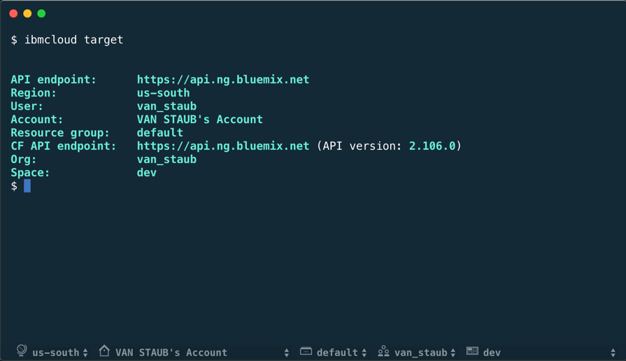

Hyper IBM Cloud Target
=========

Hyper IBM Cloud Target is a status line plugin for [Hyper](https://hyper.is/). 

- Displays [IBM Cloud CLI](https://console.bluemix.net/docs/cli/index.html#overview) configured targets
- Automatically fetches accounts, resource groups, orgs, and spaces when targets change
- Select a target to run the corresponding CLI command

**Target supports Hyper 2.1.0, which is not yet posted for download.** Use the [steps](https://github.com/zeit/hyper#contribute) on the Hyper GitHub page to build Hyper. (It's easier than you'd think.)



(Shown with [IBM Cloud theme](https://www.npmjs.com/package/hyper-ibmcloud-theme))

## Install

To install, edit `~/.hyper.js` and add `"hyper-ibmcloud-target"` to the `plugins` list.

```javascript
plugins: [
  "hyper-ibmcloud-target",
],
```

## Configuration

To configure the plugin, add the following to your `config` property in `~/.hyper.js`.

```javascript
ibmcloud: {
  sso: true,
  ui: {
    bottom: "15px"
  }
}
```

- **sso**: append the `--sso` flag to the plugin's login command
- **bottom**: offset the plugin `#px` from the bottom of screen

## Contributors

This project is forked from [Hyperline](https://github.com/Hyperline/hyperline). To also use Hyperline, adjust the `ui.bottom` property to move the Target plugin above Hyperline.
